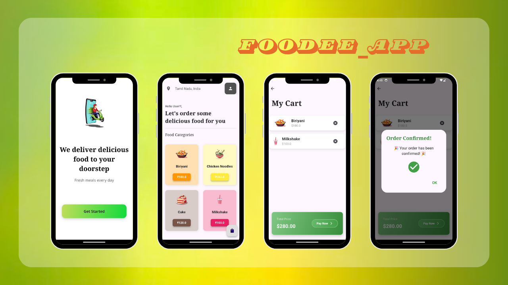

# FooDeeApp

## 🚀 App Description

**FooDeeApp** is your ultimate food delivery companion! 🍲🍕 Explore a diverse menu of delicious dishes from your favorite restaurants. With a sleek and modern interface featuring stunning gradients, ordering food has never been easier. 🛒 Effortlessly add items to your cart, proceed through a smooth checkout, and enjoy a clean slate with every new order. 🍽️

## 📸 Screenshots




## ✨ Features
- **Easy Browsing:** Navigate through categories of mouth-watering dishes. 🍣🍔
- **User-Friendly Cart:** Add and remove items with a single tap. 🛒
- **Seamless Checkout:** Secure payment options and quick order processing. 💳
- **Order Confirmation:** Visual and interactive confirmation with emojis for a delightful experience. 🎉
- **Clean Cart:** Automatic cart clearing after every order. 🗑️

## 🛠️ Installation

1. **Clone the Repository:**
    ```bash
    git clone https://github.com/NithishKumarSl/FooDeeApp.git
    ```

2. **Navigate to the Project Directory:**
    ```bash
    cd FooDeeApp
    ```

3. **Install Dependencies:**
    ```bash
    flutter pub get
    ```

4. **Run the App:**
    ```bash
    flutter run
    ```

## 🎯 Future Plans

- **User and Admin Pages:** Develop user and admin management functionalities to handle user profiles, order history, and administrative tasks.
- **Location Access Integration:** Enable users to select and save delivery locations for a more personalized and efficient service.
- **Enhanced User Experience:** Introduce features like order tracking, user reviews, and personalized recommendations.

## 📞 Feel Free to Contact

For any questions or feedback, please feel free to reach out.

